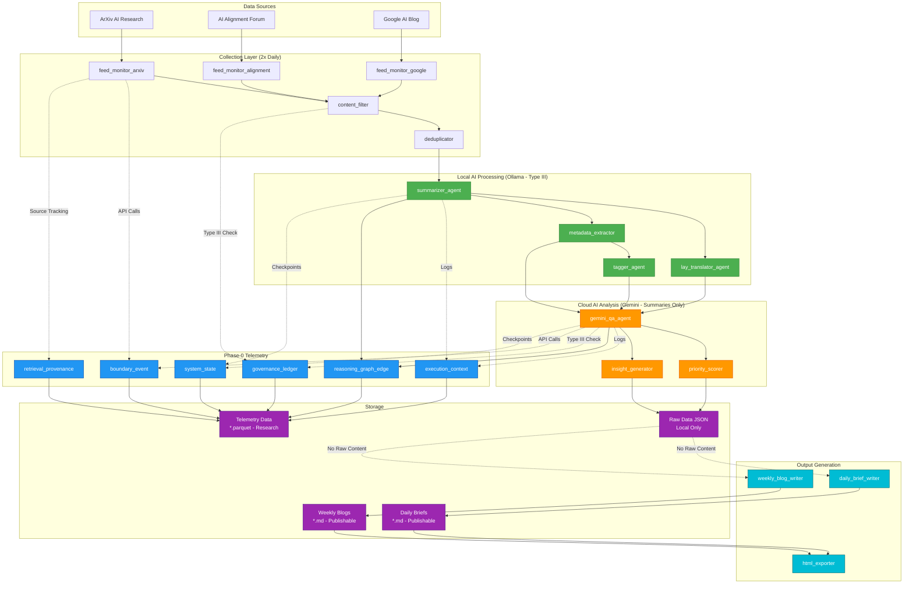
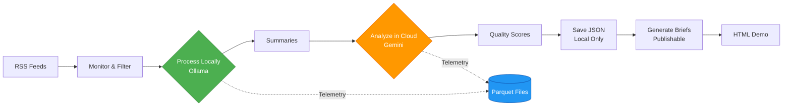
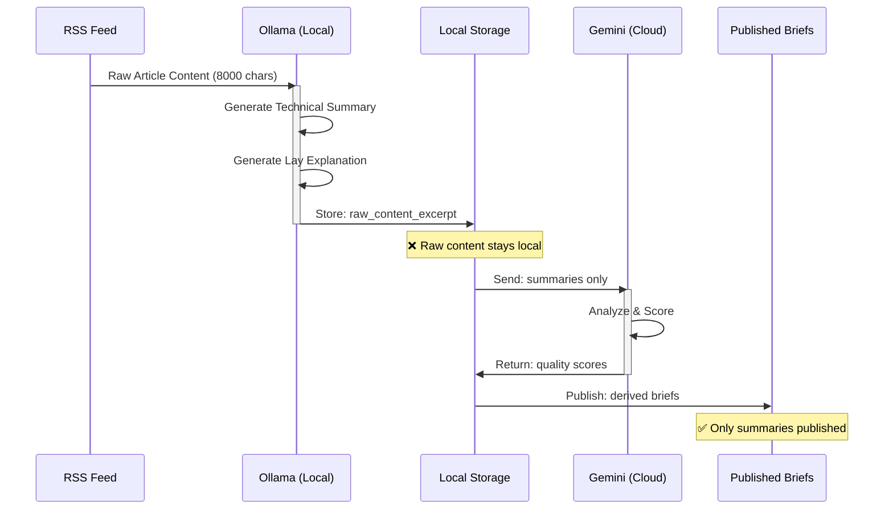

# Secure Reasoning Brief - System Architecture

## Visual Architecture Diagram (Mermaid)



---

## Simplified Flow Diagram



---

## Type III Compliance Data Flow



---

## 18-Agent System Overview

### Feed Monitoring (3 agents)
1. **feed_monitor_arxiv** - ArXiv AI research papers
2. **feed_monitor_alignment** - AI Alignment Forum posts
3. **feed_monitor_google** - Google AI Blog

### Pre-Processing (2 agents)
4. **content_filter** - Filter non-AI papers
5. **deduplicator** - Remove duplicate entries

### Local Processing - Ollama (4 agents)
6. **summarizer_agent** - Technical summaries (Type III)
7. **lay_translator_agent** - Plain language explanations
8. **metadata_extractor** - Extract title, date, authors
9. **tagger_agent** - Generate topic tags

### Cloud Analysis - Gemini (3 agents)
10. **gemini_qa_agent** - Quality assessment
11. **priority_scorer** - Relevance & significance scoring
12. **insight_generator** - Key insights extraction

### Output Generation (3 agents)
13. **daily_brief_writer** - Quick daily summaries
14. **weekly_blog_writer** - Deep weekly synthesis
15. **html_exporter** - Competition demo HTML

### Telemetry & Governance (3 agents)
16. **telemetry_logger** - Phase-0 artifact generation
17. **governance_auditor** - Type III compliance checks
18. **quality_monitor** - System health tracking

---

## Automation Schedule

```mermaid
gantt
    title Automated Pipeline Schedule
    dateFormat HH:mm
    axisFormat %H:%M

    section Daily
    Morning Collection (9 AM)   :milestone, m1, 09:00, 0m
    RSS Monitoring              :09:00, 15m
    Local Processing (Ollama)   :09:15, 20m
    Cloud Analysis (Gemini)     :09:35, 10m
    Save Results                :09:45, 5m

    Evening Collection (9 PM)   :milestone, m2, 21:00, 0m
    RSS Monitoring              :21:00, 15m
    Local Processing (Ollama)   :21:15, 20m
    Cloud Analysis (Gemini)     :21:35, 10m
    Save Results                :21:45, 5m

    section Weekly
    Weekly Synthesis (Sun 10PM) :milestone, m3, 22:00, 0m
    Load Week Data              :22:00, 5m
    Gemini Synthesis            :22:05, 15m
    Generate Blog + Citations   :22:20, 10m
```



---

## Data Storage Architecture

```
rkl-consolidated/secure-reasoning-brief/
│
├── content/briefs/               # Generated Content
│   ├── 2025-11-21_0901_articles.json      ❌ Local only (raw data)
│   ├── 2025-11-21_0901_READABLE.md        ❌ Local only (full details)
│   ├── 2025-11-21_morning_DAILY.md        ✅ Publishable
│   └── 2025-11-24_WEEKLY_BLOG.md          ✅ Publishable
│
├── data/research/                # Phase-0 Telemetry
│   ├── execution_context/        # Agent execution logs
│   ├── reasoning_graph_edge/     # Agent interactions
│   ├── governance_ledger/        # Type III compliance
│   ├── boundary_event/           # API calls
│   ├── system_state/             # System checkpoints
│   └── retrieval_provenance/     # Data sourcing
│
├── demo/                         # Competition HTML
│   ├── index.html                ✅ Publishable
│   ├── daily_briefs.html         ✅ Publishable
│   └── weekly_synthesis.html     ✅ Publishable
│
└── scripts/                      # Automation
    ├── run_pipeline.py           # Main collection script
    ├── generate_daily_brief.py   # Daily writer
    └── generate_weekly_blog.py   # Weekly writer
```

---

## Technology Stack

### Local AI (Type III Compliant)
- **Model:** Ollama llama3.2:3b
- **Hardware:** Betty cluster worker node (192.168.1.11)
- **Purpose:** Process raw content locally
- **Context:** 8000 character windows

### Cloud AI (Summaries Only)
- **Model:** Google Gemini 2.0 Flash
- **API:** Google AI Studio
- **Purpose:** Expert analysis and synthesis
- **Input:** Derived summaries only (NOT raw content)

### Telemetry System
- **Framework:** Phase-0 Research Telemetry
- **Format:** Apache Parquet (columnar)
- **Artifact Types:** 9 types (3 core + 6 enhancements)
- **Storage:** Date-hierarchical (YYYY/MM/DD)

### Automation
- **Scheduler:** Cron (Linux)
- **Frequency:** 2x daily (9 AM, 9 PM) + weekly (Sun 10 PM)
- **Runtime:** Python 3.11
- **Environment:** Conda (rkl-briefs)

---

## Key Metrics

| Metric | Value |
|--------|-------|
| **Agents** | 18 specialized agents |
| **Data Sources** | 3 RSS feeds |
| **Collection Frequency** | 2x daily (9 AM, 9 PM) |
| **Weekly Synthesis** | Sunday 10 PM |
| **Papers per Run** | ~20 papers |
| **Papers per Week** | ~280 papers |
| **Telemetry Files** | 375+ parquet files (5 days) |
| **Artifact Types** | 9 types (3 core + 6 enhanced) |
| **Type III Compliance** | ✅ Verified via governance ledger |

---

## Competition Highlights

### Innovation Points
1. **Type III Compliance** - Raw data processed locally only
2. **Multi-Agent Coordination** - 18 specialized agents
3. **Phase-0 Telemetry** - Full research audit trail
4. **Hybrid AI** - Local (Ollama) + Cloud (Gemini) coordination
5. **Automated Publication** - 2x daily + weekly synthesis
6. **Academic Rigor** - IEEE-style citations

### Real-World Application
- **Target Audience:** AI practitioners, researchers, governance professionals
- **Value Proposition:** Stay current on AI safety research without information overload
- **Output Formats:** Daily briefs (2-3 min) + Weekly synthesis (10-15 min)
- **Transparency:** All claims verifiable via links and citations

---

*Architecture documentation for Kaggle 5-Day AI Agents Intensive Capstone*
*Generated: November 22, 2025*
