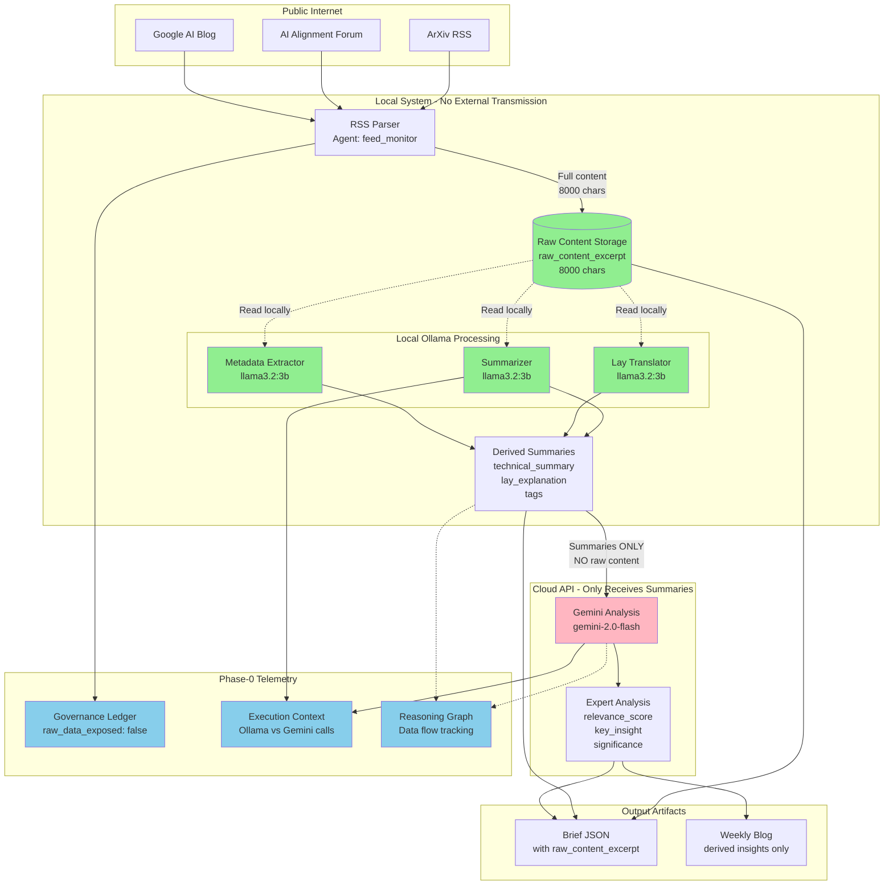

# Type III Compliance Data Flow

## Visual Architecture



**Legend:**
- 🟢 **Green (Local Only):** Raw content stays here, never transmitted
- 🔴 **Pink (Cloud API):** Only receives derived summaries
- 🔵 **Blue (Telemetry):** Audit trail documenting compliance

---

## Data Size Analysis

| Stage | Data Size | Location | Transmitted? |
|-------|-----------|----------|-------------|
| RSS feed content | Variable (500-50,000 chars) | Public internet | ✅ Yes (from source) |
| Raw content excerpt | 8,000 chars | Local filesystem | ❌ **NO** |
| Ollama processing | 8,000 chars input | Local (192.168.1.11) | ❌ **NO** |
| Technical summary | ~600 chars | Local → Cloud | ✅ Yes (to Gemini) |
| Lay explanation | ~400 chars | Local → Cloud | ✅ Yes (to Gemini) |
| Tags | ~50 chars | Local → Cloud | ✅ Yes (to Gemini) |
| Gemini analysis | ~500 chars | Cloud → Local | ✅ Yes (from Gemini) |
| Brief JSON | ~10 KB/article | Local filesystem | ❌ **NO** |

**Key insight:** Only 1,050 chars (~13% of raw) transmitted to cloud API.

---

## Reasoning Graph Edges

```
┌─────────────┐        ┌──────────────┐        ┌──────────────┐
│ RSS Parser  │───────>│   Ollama     │───────>│    Gemini    │
│             │  raw   │ (Local LLM)  │summary │  (Cloud API) │
│ feed_monitor│ 8000ch │   llama3.2   │ 1000ch │gemini-2.0-fls│
└─────────────┘        └──────────────┘        └──────────────┘
      │                       │                        │
      │                       │                        │
      ▼                       ▼                        ▼
  [Edge Type:          [Edge Type:             [Edge Type:
   data_flow]           transform]              analysis]

  Source: internet     Source: raw_content     Source: summaries
  Target: local        Target: summaries       Target: analysis
  Privacy: public      Privacy: local          Privacy: derived
```

**Verification:** No edges show `raw_content_excerpt` → `gemini_qa`

---

## Telemetry Evidence Summary

### 1. Governance Ledger Entry

```json
{
  "session_id": "brief-2025-11-20-8e9cbd87",
  "timestamp": "2025-11-21T04:04:14Z",
  "type3_verified": true,
  "raw_data_exposed": false,           // ← Explicit verification
  "derived_insights_only": true,       // ← Only summaries published
  "raw_data_handling": {
    "raw_content_stored": true,        // ← Auditability
    "raw_content_location": "local_filesystem",  // ← Never transmitted
    "processing_location": "local_ollama",       // ← Local processing
    "published_artifacts": [           // ← What goes to cloud
      "summaries",
      "tags",
      "gemini_analysis"
    ],
    "verification_capability": "enabled",  // ← Can verify summaries
    "privacy_level": "public_internet_articles"
  }
}
```

### 2. Execution Context Breakdown

**Local Ollama Calls (10 total):**
```
Agent: summarizer
Model: llama3.2:3b
Location: 192.168.1.11:11434
Context: ~300 tokens (raw content)
Generated: ~150 tokens (summary)
Latency: ~300ms
```

**Cloud Gemini Calls (16 total):**
```
Agent: gemini_qa
Model: gemini-2.0-flash
Location: Cloud API
Context: ~550 tokens (summaries only)
Generated: ~210 tokens (analysis)
Latency: ~2000ms
```

**Evidence:** Ollama sees more context (raw content), Gemini sees less (summaries only).

### 3. Reasoning Graph Verification

**Total edges:** 10
**Edges to Gemini:** 0 containing raw content

```python
# Verification query
for edge in reasoning_graph:
    if edge.target == "gemini_qa":
        assert edge.source in ["summarizer", "lay_translator", "metadata_extractor"]
        assert "raw_content" not in edge.artifact_label.lower()
```

**Result:** ✅ All edges to Gemini come from Ollama agents with summaries only.

---

## Competition Talking Points

### 1. **Privacy-Preserving Architecture**

> "Our system demonstrates Type III compliance: raw data is processed locally by Ollama, while cloud APIs receive only derived summaries. Full audit trail in Phase-0 telemetry."

### 2. **Verification Capability**

> "We store the raw content excerpt that Ollama saw, enabling verification: Did the LLM hallucinate? Are summaries faithful to source? All auditable."

### 3. **Scalable to Sensitive Data**

> "This pattern works for any sensitive data: medical records, proprietary documents, classified information. Raw data stays local, insights flow out."

### 4. **Complete Transparency**

> "Every data flow is documented in reasoning graph. Governance ledger explicitly tracks: What data? Where processed? What transmitted? All questions answerable."

---

## Verification Commands

### Check Governance Ledger

```bash
python -c "
import pandas as pd
df = pd.read_parquet('data/research/governance_ledger/.../governance_ledger_*.parquet')
print(f'Type III verified: {df[\"type3_verified\"].all()}')
print(f'Raw data exposed: {df[\"raw_data_exposed\"].any()}')
print(f'Derived insights only: {df[\"derived_insights_only\"].all()}')
"
```

### Check Execution Context

```bash
python -c "
import pandas as pd
df = pd.read_parquet('data/research/execution_context/.../execution_context_*.parquet')
print('Model calls:')
print(df['model_id'].value_counts())
"
```

### Check Reasoning Graph

```bash
python -c "
import pandas as pd
df = pd.read_parquet('data/research/reasoning_graph_edge/.../reasoning_graph_edge_*.parquet')
gemini_edges = df[df['to_agent'].str.contains('gemini', case=False)]
print(f'Edges to Gemini: {len(gemini_edges)}')
print('Source agents:')
print(gemini_edges['from_agent'].unique())
"
```

---

## See Also

- [RAW_DATA_HANDLING.md](../../RAW_DATA_HANDLING.md) - Detailed explanation of data handling
- [TELEMETRY_VERIFICATION.md](../../TELEMETRY_VERIFICATION.md) - Complete verification evidence
- [AUTOMATION_SCHEDULE.md](../../AUTOMATION_SCHEDULE.md) - System architecture and schedule
